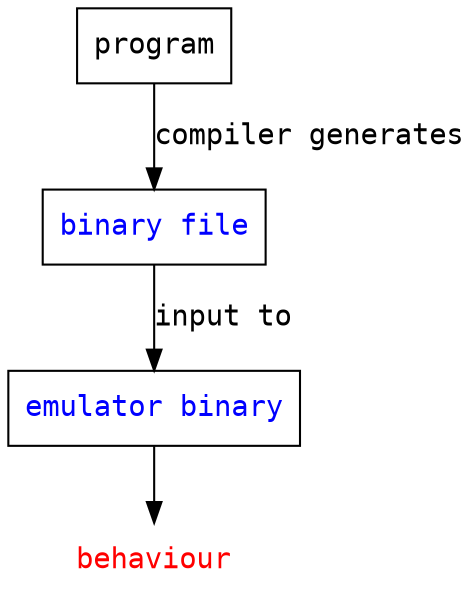
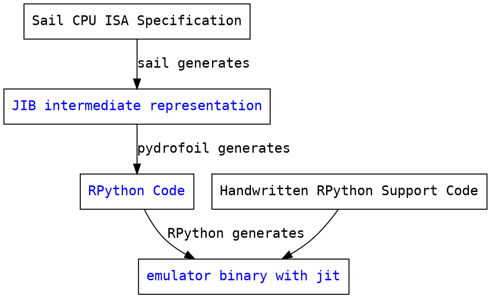
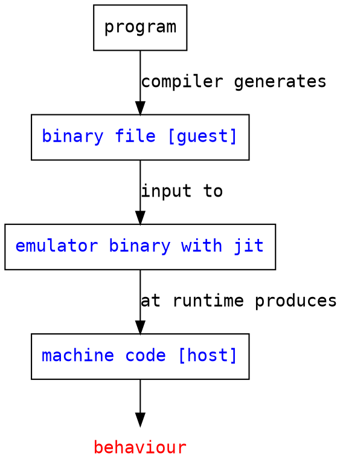

Notes about mapping JIB to RPython
=

JIB types:
==

- enums
- unions
- struct
- int (signed, idealized arbitrary precision)
- i64 (signed, machine int)
- bv (arbitrary size, not signed)
- bv<num> (bit vector fixed size, not signed), eg bv16
- sbv<num> (bit vector with an unknown size that's not larger than num), eg sbv16
- function
- tuple (are initialized with mutation at the JIB level)
- bool
- string
- bit (why is this different from bv1?)
- ref: pointers
- list: linked list
- unit (="void")

Mapping to RPython:

- enums: int constants, enum constants get globally unique numbers from 0
- unions: base class with different subclasses for the union members
- struct: a single class. are they immutable? does assignment copy them?
- int: rpython.rlib.rbigint.rbigint (for now)
- i64: Python int
- bv and sbv<num>: bitvector.BitVector (two concrete subclasses, for big and small bitvectors)
- bv<num>: `rpython.rlib.rarithmetic.r_uint`
- function: rpython function
- tuple: generate one rpython class per combination of types, fields `ztup0`, ..., `ztup<n>`
- bool: rpython bool
- string: rpython str
- bit: `r_uint(0 or 1)`
- ref: unclear! to structs: just use the struct. but to primitives I don't know yet
- list: one custom List type per kind of list
- unit: rpython empty tuple

Operations on values (of the types)
==

- function calls to other jib functions: maps to function calls in rpython
- "magic", built-in operations, prefixed with "@"

Diagrams
==

## C emulator generation

custom_mark10
digraph hierarchy {

    node [fontname=Courier,shape=box]
    edge [fontname=Courier]

    model [label="Sail CPU ISA Specification"]
    model->coq [label="sail generates"]
    coq [label="coq model", fontcolor=blue]
    model->jib [label="sail generates"]
    jib [label="JIB intermediate representation", fontcolor=blue]
    jib->C [label="sail generates"]
    C [label="C Code", fontcolor=blue]
    support [label="Handwritten C Support Code"]
    support->emulator
    C->emulator [label="GCC generates"]
    emulator [label="emulator binary", fontcolor=blue]
}
custom_mark10

## C emulator execution

## Pydrofoil: C emulator generation with JIT

## C emulator execution with JIT

